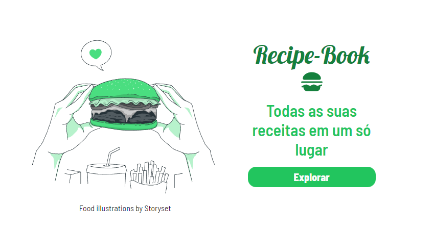
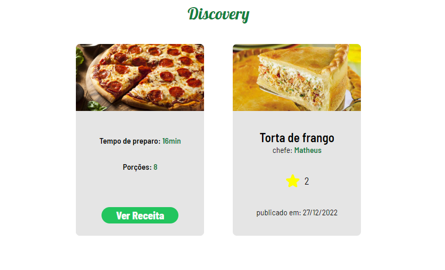

# Recipe-book

    
    
    

> ⚠️ Projeto ainda em desenvolvimento ⚠️

Hoje em dia é muito comum encontrar na internet receitas de deliciosos pratos.

Com isso em mente decidi criar uma plataforma onde seja possivel encontrar todas essas receitas em um só lugar, e ao mesmo tempo praticar minhas habilidades como programador

## Tecnologias usadas 🛠️
* TypeScript
* React.js
* Styled-Components
* React-Router-Dom
* Node.js